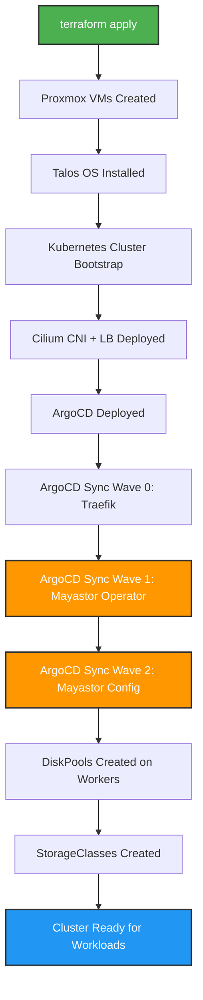

# Automated Deployment Flow

## Infrastructure as Code - Zero Manual Steps



## Deployment Stages

### Stage 1: Infrastructure (Terraform)
```bash
cd infrastructure/terraform
terraform apply
```

**Automated Actions:**
- ✅ Create 4 VMs (1 CP + 3 workers)
- ✅ Configure dual NICs (management + storage)
- ✅ Install Talos OS with Mayastor kernel modules
- ✅ Bootstrap Kubernetes cluster
- ✅ Deploy Cilium CNI with LoadBalancer support
- ✅ Deploy ArgoCD GitOps controller
- ✅ Label nodes with `openebs.io/engine=mayastor`

**Duration:** ~15 minutes

### Stage 2: Platform Services (ArgoCD)
ArgoCD automatically syncs from Git and deploys applications.

#### Sync Wave 0 (Infrastructure)
- **Traefik Ingress**: LoadBalancer on Cilium (10.10.0.80)

#### Sync Wave 1 (Storage Operator)
- **Mayastor Operator**: Helm chart from OpenEBS
  - API server
  - CSI controller
  - IO engines on workers
  - etcd cluster (3 replicas)

#### Sync Wave 2 (Storage Configuration)
- **DiskPools**: Automatically created on each worker
  ```yaml
  pool-worker-01: talos-worker-01 → /dev/sdb (300GB)
  pool-worker-02: talos-worker-02 → /dev/sdb (300GB)
  pool-worker-03: talos-worker-03 → /dev/sdb (300GB)
  ```

- **StorageClasses**: Automatically created
  ```yaml
  mayastor-3: 3-way replication (default)
  mayastor-2: 2-way replication
  mayastor-1: Single replica
  ```

**Duration:** ~10 minutes

### Stage 3: Applications (ArgoCD)
- **Cert-Manager**: TLS certificate automation
- **External Secrets**: Secret synchronization
- **Media Apps**: Sonarr, Radarr, Prowlarr, Transmission, Overseerr

**Duration:** ~5 minutes

## Total Automated Deployment Time
**~30 minutes** from `terraform apply` to fully operational cluster with storage.

## What's NOT Automated (Yet)
These require manual setup due to external dependencies:

1. **Proxmox vmbr1 bridge**: Physical network configuration
2. **Plex LXC**: GPU passthrough configuration
3. **TrueNAS VM**: Optional NFS server (commented out in Terraform)
4. **DNS/DHCP updates**: External network services

## Verification Commands

### Check Infrastructure
```bash
# Nodes
kubectl get nodes -o wide

# Cilium
cilium status
kubectl get ciliumloadbalancerippool
kubectl get ciliuml2announcementpolicies
```

### Check Storage
```bash
# Mayastor operator pods
kubectl get pods -n mayastor

# DiskPools (should show 3, all Online)
kubectl get diskpools -n mayastor -o wide

# StorageClasses (mayastor-3 should be default)
kubectl get sc

# Test PVC
kubectl apply -f - <<EOF
apiVersion: v1
kind: PersistentVolumeClaim
metadata:
  name: test-pvc
  namespace: default
spec:
  accessModes: [ReadWriteOnce]
  resources:
    requests:
      storage: 1Gi
  storageClassName: mayastor-3
EOF

# Check PVC bound
kubectl get pvc test-pvc -w
```

### Check Applications
```bash
# LoadBalancer services
kubectl get svc -A | grep LoadBalancer

# Traefik
kubectl get pods -n traefik

# Media apps
kubectl get pods -n media
```

## ArgoCD Applications Structure

```
platform/ (App of Apps)
├── traefik-app.yaml           # sync-wave: 0
├── mayastor-app.yaml          # sync-wave: 1 (operator)
├── mayastor-config            # sync-wave: 2 (diskpools + storageclasses)
├── cert-manager-app.yaml      # sync-wave: 1
├── external-secrets-app.yaml  # sync-wave: 1
└── applications-app.yaml      # sync-wave: 3

applications/ (Media Stack)
├── sonarr-app.yaml
├── radarr-app.yaml
├── prowlarr-app.yaml
├── transmission-app.yaml
└── overseerr-app.yaml
```

## Disaster Recovery

### Full Cluster Rebuild
1. Backup Infisical secrets and Git repo
2. Run `terraform destroy`
3. Run `terraform apply`
4. Wait ~30 minutes
5. Cluster restored to desired state

### Storage Recovery
If DiskPools fail:
1. Delete DiskPool resources: `kubectl delete diskpool -n mayastor --all`
2. ArgoCD will automatically recreate them (self-heal enabled)

### Application Recovery
ArgoCD auto-sync and self-heal enabled:
- Deleted resources are recreated automatically
- Configuration drift is corrected automatically
- Git is the single source of truth

## Benefits of This Architecture

### Full GitOps
- ✅ Everything in Git
- ✅ Declarative configuration
- ✅ Automatic synchronization
- ✅ Self-healing

### Zero Manual Steps
- ✅ No kubectl apply required
- ✅ No manual pool creation
- ✅ No manual label management
- ✅ Idempotent deployments

### Repeatable
- ✅ Destroy and rebuild anytime
- ✅ Consistent results
- ✅ Version controlled
- ✅ Auditable changes

### Observable
- ✅ ArgoCD UI shows deployment status
- ✅ Sync waves provide ordering
- ✅ Health checks validate state
- ✅ Git history provides audit trail

---

**Last Updated:** October 31, 2025
**Cluster:** homelab-test on "the fal"
